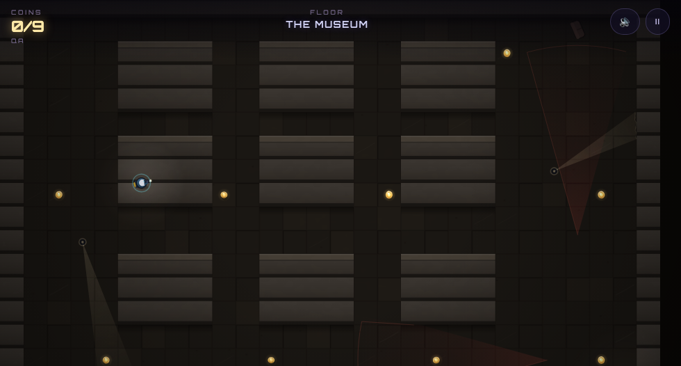

# Flashpoint

> A heist in a world with no light — only two 30° cones. Yours is white. Theirs is red.

A tiny, pretty, no-build browser stealth-arcade game — one HTML file, zero
dependencies, no image or audio assets. Everything is drawn and synthesized at
runtime.



## The game

Sweep a dark complex of rooms, aisles and neon streets with your flashlight,
grab every coin, and reach the door — while security drones patrol with their
own 30° vision cones. The layout is always faintly readable, but **the hunters
and the gold both hide in the dark** — your beam is the only thing that reveals
either. They see what their light sees, and nothing else.

- **True occlusion** — both cones are raycasts. A corner between you and a
  red beam is a corner between you and a red beam. Peek around it with the
  mouse without leaning your body into the light.
- **Gold does not glow** — an unlit coin is not on your screen at all. Sweep a
  room to find its coins; once your beam has touched one it stays pinned as a
  ring you can navigate back to. Stand close and you'll catch a faint glint off
  one you haven't found yet. Coins sitting in a lamp pool are visible without
  your torch — and standing in that pool is what gets you caught.
- **You are carrying it** — the satchel on your back fills with gold as the floor
  empties, so a glance at yourself tells you how much of the haul is already on
  you and how much of the room is left to sweep.
- **Sound is a currency** — sprinting and grabbing coins make noise. Bots hear
  noise, walk to it, and swing their cones while investigating. Walk (or tilt
  the stick a little) to go quiet.
- **The torch runs out** — about 45 seconds of continuous light, recovering
  slowly while it is off. Sweeping a room costs you something now, so the question
  stops being "where is the gold" and becomes "where can I afford to look". Run it
  flat and it cuts out until it has rested. `B` cells top it back up.
- **Flares buy light at a distance** — two per floor, thrown with `Q`. One lights
  a room for eleven seconds so you can read its gold without spending torch on
  it, and it keeps burning through a blackout when every mains lamp is dead. It
  also lands loudly, and drones walk toward light. You are buying sight with
  attention.
- **Throw a coin to be somewhere else** — `E` lobs one you are carrying. It
  clatters where it lands and drones walk to noise. The floor still wants every
  coin, though, so you have moved gold you need toward the thing now coming to
  look at it.
- **Smoke hides you from yourself too** — one pellet a floor, dropped at your
  feet with `X`. Nothing sees through it: not a drone's cone, not a searchlight.
  But you are standing in the same cloud, so your own beam chokes to a stub while
  you are inside it. Cover and blindness are the same nine seconds.
- **An EMP costs you the lights** — one charge a floor on `C`. Everything
  electric inside the bubble stops for five and a half seconds: lamps, neon,
  cameras, laser gates. It is local, so gates outside it keep running. And the
  lamps it kills were the ones showing you where the gold was.
- **A decoy keeps talking** — one a floor on `V`. A thrown coin is a single
  clatter and they drift back; a decoy chirps every second or so for twelve, which
  is long enough to walk a corridor they were standing in.
- **The magnet does not need to see** — eight seconds of dragging any loose coin
  within reach toward you, lit or not, which is how you strip a black room
  without spending torch on it. Every coin it lands still fires the pickup noise,
  so a big haul is a loud one.
- **Locked doors take a card or a wait** — four floors seal a corridor behind a
  lock. A keycard found elsewhere opens one the moment you reach it. Without one
  you pick it, which takes a second and a half of standing perfectly still in a
  doorway, and moving cancels it. There is always a way through, so no floor can
  strand you.
- **The kit is yours for the whole run** — you start with one flare and one smoke
  pellet, and everything else is found. Twenty gadgets lie scattered across the
  twelve floors, one on the House and four in the CORE, and what you carry goes
  down the stairs with you. A flare you skipped on floor two is a flare you do
  not have when the lights go out.
- **Cameras never move, so they have a safe side** — the secured floors mount
  fixed lenses on the walls, each looking down its longest clear line. Unlike a
  sweeping searchlight there is no waiting for it to pass: you learn the angle
  and take the other route. They are on the same circuit as everything else, so
  smoke breaks their line and an EMP puts them out.
- **Vents are yours alone** — grilles cut through walls that you fit through and
  a drone does not. On the Warehouse the shortcut is two tiles for you against an
  eighteen-tile detour for anything chasing you, which is the difference between
  being followed and being lost.
- **Glass shows you what you cannot reach** — panes in the Bank Vault and the
  CORE stop bodies and not sight. You can watch a room full of gold you have to
  walk around, and a drone on the far side can watch you right back through cover
  you thought you had.
- **Standing water gives you away** — pools on the Ward and the Docks. Walking on
  dry floor is silent; walking through a puddle is not, and it carries further
  than a sprint does. Soft shoes will not save you either, which is the point:
  the best movement tool in the game has one place it does not work.
- **Pressure plates are laid where you have to walk** — ten of them across the
  secured floors, in corridors with walls on both sides. Step on one and it
  screams your position to everything nearby. You can make out the outline in the
  dark, but only your beam tells you exactly where its edges are, which is one
  more thing the torch is for.
- **Mirrors let you look before you go** — angled panes in corners on four
  floors. Put your beam on one and it turns ninety degrees and lights the
  corridor round the corner, a little dimmer for the trip. You get to see what is
  waiting without walking into its line of sight.
- **Crates are a choice, not a chore** — nine of them standing in open floor.
  Lean on one for a second and it splits, dropping a coin and making a lot of
  noise. That coin is a bonus and never part of the floor's count, so nothing
  makes you take it: you are trading quiet for score.
- **They can see your beam** — a drone does not need to see *you*. Give it a clear
  view of the floor your torch is lighting for about a second and it comes to
  look, at the patch rather than at you. Sweeping a room stays safe; holding the
  light on one spot does not. It is also baitable, since they walk to the light
  and not to its owner.
- **Gold is heavy and it jingles** — your footsteps carry further the more of the
  floor you are carrying, from 520 with empty pockets to 806 with the lot. The
  walk in is the quiet part; the run back to the door with everything on you is
  not.
- **The building remembers** — every time they pin you down, step on a plate or
  get lit by a spotlight, the alert level goes up a notch and every drone in the
  run gets 8% faster. It never falls until you start again, so a scrappy second
  floor is something you pay for in the CORE. Four notches is the ceiling.
- **The net closes from several sides** — a drone that radios your position does
  not send the others to the same cell any more. Each one gets its own bearing on
  you and claims it, so they arrive spread around you rather than nose to tail
  down one corridor. Backing into a room is a worse idea than it used to be.
- **Breaking line of sight is not the end of it** — a drone that loses you walks
  to where you were and then searches outward from it, four or five spots in a
  widening spiral, before it gives up and goes back on patrol. Ducking round a
  corner buys you seconds, not safety.
- **They check the other way** — a patrolling drone stops where a corridor turns
  or branches, sweeps its cone out and back, then carries on. It makes a patrol
  slower and much harder to time, because the pause happens exactly where you
  would want to slip past behind it.
- **They cut, they do not follow** — a chasing drone paths to where you will be
  in half a second rather than where you are, so it takes the corner you were
  about to take. The lead is short and it collapses back to your actual position
  the moment the shortcut runs into a wall, which keeps it a hunt rather than an
  aimbot.
- **They do not forget straight away** — a drone that gives up rejoins its patrol
  at the nearest point rather than marching back to wherever it had got to before
  you distracted it, and for the next few seconds it sweeps wider and sees a
  little further. The safest moment to move is not the one right after it turns
  away.
- **Light is a liability** — standing in a lamp or neon pool makes the meter
  fill faster. The darkness that hides you from them is also what blinds you.
- **Memory** — what your beam recently lit stays faintly burned into your view,
  so sweeping is mapping.
- **They get better as you go deeper** — a drone that spots you accelerates the
  longer it holds you, floor by floor, until only a sprint escapes it. From the
  Museum down they run a radio net: one drone seeing you sends the rest.
  Searchlights are part of that net — stand in one and it screams your position.
- **Three things worth crossing a dark room for** — power-ups carry their own
  light, so you can see them from across a black floor. **Lens** stretches the
  beam by 60% for 14s, which is how you clear a big room fast now that gold needs
  lighting. **Soft shoes** make you 32% quicker *and* silence your sprint for 11s
  — the only time running is free. **Ghost** freezes the detection meter for 8s.
- **Caught = run over.** One meter-fill and it's done. Twelve floors to clear,
  then endless loops. Your name rides on a device-local leaderboard (no login,
  no accounts, nothing leaves the browser).

## The twelve floors

| # | Floor | Light | Threat |
|---|-------|-------|--------|
| 1 | The House | warm lamps, TV flicker | 1 slow patroller |
| 2 | The Warehouse | swaying hang-lamps, dust shafts | 1 fast patroller |
| 3 | Neon Heights | rain, flickering neon pools | 2 bots, crossing loops |
| 4 | The Abandoned | near-dark, random 4s blackouts | 2 bots in the black |
| 5 | The Museum | marble slabs, golden calm | 2 bots + **sweeping searchlights** + a fixed camera |
| 6 | The Server Farm | cold raised panels, LED racks | 2 bots + **pulsing laser gates** — a live beam spikes detection and screams your position |
| 7 | The Bank Vault | brass-lit vault rooms | 3 bots + **siren sweeps** — periodically every drone wakes and its cone grows |
| 8 | The Fog Docks | rain, amber dock lamps | 3 bots + **fog banks** — your beam strangles to a candle for six seconds |
| 9 | The CORE | red emergency gloom | 3 fast bots + blackouts + sirens + searchlights. Everything listens. |
| 10 | The Gallery | museum marble, long halls | 3 bots + sirens + cameras + plates |
| 11 | The Cold Store | dock amber, standing water | 3 bots + fog + flooded aisles + crates |
| 12 | The Penthouse | city neon, open plan | 4 bots + sirens + blackouts + glass + cameras |

Clear all twelve → **YOU ESCAPED** → endless mode: the rotation repeats, loops
add bots and speed, and your best depth per device is kept.

## Controls

| | Desktop | Mobile / tablet |
|---|---|---|
| Move | `WASD` / arrows | **left thumb** floating stick |
| Sneak | (walk = quiet already) | tilt the stick a **little** |
| Sprint (loud) | `Shift` | stretch the stick **all the way** |
| Aim beam | **mouse** | **right thumb** stick (aim holds when you let go) |
| Ping of doubt | — | just stop moving |
| Torch on/off | `F` | HUD buttons |
| Throw a flare | `Q` | HUD buttons |
| Throw a coin | `E` | HUD buttons |
| Drop smoke | `X` | HUD buttons |
| Fire an EMP | `C` | HUD buttons |
| Set a decoy | `V` | HUD buttons |
| Run the magnet | `G` | HUD buttons |
| Any gadget | the key shown on it | **tap it in the item bar** |
| Mute / pause | `M` / `P` | HUD buttons |
| Restart | `R`, or `Space` on the card | tap the button |

Portrait works; landscape is the intended view. Touch devices get their own
DPR cap and particle budgets automatically. Haptics fire where supported
(Android) when a cone touches you and on capture.

## How it works

- **Lighting stack**: the world renders under a soft darkness layer, punched
  open by the flashlight fan and lamp pools. The exit beacon and your thief ride
  *above* the darkness and stay readable; drones and coins render only where
  light actually reaches them — your cone, or a lamp pool. Darkness means "one of
  them might be standing right there, and so might the money".
- **Vision**: both cones are grid raycasts; detection = in-cone + clear LOS +
  distance. Bots path with A* on the 28×18 tile grid; the bot that heard you
  walks to the noise, not to you — you are never aimbot-tracked, only hunted.
- **Maps** are ASCII tile strings (validated for connectivity at boot and by
  the test harness: exit reachable, every coin reachable, every route
  waypoint walkable).
- **Audio** is a small WebAudio synth (drone, heartbeat that follows the
  detection meter, sirens, footsteps, rain noise bed) — no files.
- Test hooks: `?autostart` starts a run immediately, `?name=ROBBIE` sets the
  runner name. Harmless in normal play; used by the CI-style harness.

## Run it

Open `index.html` in any browser. Done. Or `npx serve .`

**Hosting on Vercel** (or Netlify/GitHub Pages): this is a static single file —
import this repo, framework preset *Other*, build command empty, output
directory `.` — deploy. (GitHub Pages is already enabled on this repo:
https://krabduke.github.io/flashpoint/)

## Tests

```sh
node test/flashpoint.cdp.mjs
```

A dependency-free CDP harness (Node ≥ 22, native WebSocket) drives real
headless Chrome through the real game loop and asserts actual state:
map connectivity (all twelve floors), mouse aim, live coin pickup, cone
detection filling → caught → card, LOS hiding draining, searchlight exposure,
laser-gate zap, siren sweep, fog beam-shrink, blackouts, full campaign → win →
endless escalation, leaderboard persistence, twin thumbstick touch lifecycle,
portrait viewport, and zero console errors.

It also asserts pixels where a predicate is not enough: that a lit coin is
actually brighter than the floor beside it, that a remembered one stays findable,
and that a filling meter really does turn the screen edge red.

## The ghost of your best run

Clear a floor and the route you took is kept. Play it again and that route is
drawn faintly behind you, so you are racing the last version of yourself rather
than a stranger. Only a faster clear replaces one, and endless runs never
overwrite a campaign ghost.

## Endless has rules

Every loop past the campaign draws one of eight, printed beside the floor name:
an extra drone on every floor, a meter that pins you faster, a torch that burns
out sooner, lamps that stay dark, blackouts everywhere, sirens everywhere, fog
everywhere, or a magpie's curse that pays double for gold and makes you ring
like a bell carrying it.

The rule comes from the loop number, so a daily endless run gives everyone the
same one.

## Three ways to play

**Standard** is the game as tuned. **Casual** slows the drones, fills the meter
more gently, stretches the torch and hands you a spare of everything. **Blackout**
does the opposite: faster drones, a meter that fills in a quarter less time, a
torch that dies a third sooner, and you start with nothing but what you find.

Gold is worth 0.7x, 1x and 1.5x respectively, so the leaderboard keeps meaning
something across all three.

## Twelve things worth doing

Unlocks are about the systems rather than attendance: clear a floor without being
detected, without sprinting, or without your light ever being spotted; take a
coin with your torch off; pick a lock with no keycard; find gold by mirror light;
leave a floor with every coin on it; win with the alert level still at zero. They
sit under the floor picker and live on your device with everything else.

## Daily run

Turn on **Daily Run** from the menu and everything the game rolls comes from
today's date instead of chance: the same lamp sizes, the same drone facings, the
same searchlight directions, for everyone, all day. The seed is printed under the
button so two people can check they played the same building. Audio texture and
particle scatter stay unseeded, because nobody is comparing those.

Add `?daily` to the URL to start in it.

## What it remembers

A lifetime record sits under the floor picker: runs played, campaigns cleared,
best clear time, and total gold lifted. It lives in `localStorage` beside the
leaderboard — same promise, nothing leaves the device.

## Privacy

No accounts, no network, no telemetry. Name and leaderboard live in
`localStorage` on the player's own device.

## License

MIT — see [LICENSE](LICENSE).
